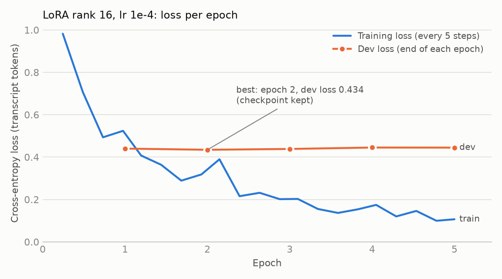

# Fine-tuning: Qwen3-ASR 1.7B on Malaysian speech (LoRA)

**Result.** LoRA on the decoder (rank 16, lr 1e-4, best of 5 epochs by dev loss) lowers held-out WER
from **17.1% to 14.77%** (−2.3 points, −14% relative) and CER from 7.5% to 6.68%, with **no loss on
the English control set** (1.7% → 1.70%). Training takes under 4 minutes and 14.1 GiB on one RTX
3090. The merged checkpoint is on the Hugging Face Hub as `king17pvp/qwen3-asr-1.7b-malaysian`
(public), loads in Transformers and in vLLM 0.30.0, and gives the same accuracy in both (14.77% vs
14.71%).

All numbers come from `results/train/`, `results/merge/`, `results/push/`, `results/eval/` and
`data/manifests/stats.json`. The pretrained baseline is `reports/ResultsBeforeFineTuning.md`.

## 1. Data

Built by `uv run asr-assess data` from `configs/data.yaml` (seed 20260925, clean tree at
`a935491`). Every clip is 16 kHz mono 16-bit WAV, 2–30 s.

| Split | Clips | Minutes | 2–5 s | 5–15 s | 15–30 s | Used for |
|---|---:|---:|---:|---:|---:|---|
| Train | 322 | 35.14 | 9.82 | 16.94 | 8.37 | gradient updates |
| Dev | 37 | 3.91 | 0.82 | 2.33 | 0.77 | choosing the epoch (eval loss) |
| Eval | 123 | 12.28 | 4.12 | 5.90 | 2.26 | the before/after WER |
| Control | 44 | 5.02 | 1.49 | 2.35 | 1.18 | forgetting check, never trained on |

| Category | Source | Train min | Eval min | Train / eval groups |
|---|---|---:|---:|---:|
| Manglish / code-switching | `mesolitica/Malaysian-STT-Whisper` (`malaysian_context_v2`, YouTube pseudo-labels) | 20.04 | 6.02 | 164 / 41 videos |
| Malay conversational | `mesolitica/Malaysian-STT-Whisper` (`extra`, malay-conversational-speech-corpus) | 5.05 | 2.03 | 6 / 4 speakers |
| Malay read | `google/fleurs` `ms_my` (validation → train, test → eval) | 5.00 | 2.21 | 27 / 14 speakers |
| English read | `google/fleurs` `en_us` (validation → train, test → eval) | 5.05 | 2.02 | 36 / 15 speakers |
| Control | LibriSpeech test-clean | — | 5.02 | 12 speakers |

**Preprocessing** (`data/sources.py`, `data/build.py`, `core/text.py`):

- Only one or two parquet shards per Malaysian-STT-Whisper split are downloaded (the dataset is
  139 GB); clips are chosen from metadata first, then only the chosen audio is fetched.
- Whisper special and timestamp tokens (`<|0.26|>`, language tags) are stripped from the
  transcripts.
- YouTube videos whose transcript reads as Indonesian rather than Malay are excluded
  (`data/language.py: flag_indonesian`).
- Audio is resampled to 16 kHz mono; clips outside 2–30 s or with fewer than 2 words are dropped, and
  each split is filled to target shares per duration bucket (30% 2–5 s, 45% 5–15 s, 25% 15–30 s).
- **Eval is held out by speaker / video:** whole groups move to eval, so no eval speaker or video
  appears in training. Dev is drawn from the train-side pool and never contains a train clip; for
  Malay conversational (only 6 train speakers) dev shares speakers with train, which only affects
  epoch selection.
- Training targets use the Qwen3-ASR format `language Malay<asr_text>…` (or `language
  English<asr_text>…`), and `language None<asr_text>…` for mixed-language Manglish clips.

## 2. Method

**LoRA on the decoder only**, through PEFT on the native Transformers model
(`Qwen3ASRForConditionalGeneration`), with our own Trainer script (`training/`).

- Targets: `q_proj, k_proj, v_proj, o_proj, gate_proj, up_proj, down_proj` in every layer of the
  Qwen3-1.7B language model: 196 LoRA modules. The ~300M-parameter audio encoder and the projector
  are frozen.
- **Loss on transcript tokens only** (`training/collator.py`): each example is the same chat
  prompt inference uses (audio user turn) plus the reply; labels mask everything except the reply,
  so the model is never trained to predict prompt or audio tokens.

**Why LoRA, and why the decoder:**

- **Data size.** 35 minutes of audio is ~320 utterances. Full fine-tuning of 2B parameters on that
  would overfit within an epoch and risks forgetting English; a rank-16 adapter trains 0.85% of
  the weights, which acts as a strong regularizer.
- **Where the errors are.** Many baseline errors on Malaysian speech are about which words and
  spellings to produce (Malay and code-switched vocabulary, conventions such as `okey`, names,
  language-ID drift on short Malay clips), which the language model decides. The audio encoder is
  already trained on a large multilingual corpus; leaving it frozen protects the control set.
- **Cost.** Under 4 minutes and 14 GiB per run, which made a 6-run sweep affordable, and the adapter
  merges into the base weights, so serving needs no PEFT at runtime (vLLM serves a plain checkpoint).
- Alternatives considered: full fine-tuning (too little data, too much memory); training the
  encoder too (more forgetting risk for an uncertain gain on 35 minutes); ms-swift (`swift sft`,
  model type `qwen3_asr`) is documented as a fallback but was not needed.

### Hyperparameters (served run)

The served run's config is identical to the committed default `configs/lora.yaml` (the sweep copy
`configs/lora_rank16_dropout10_lr1e-4.yaml` differs only in its name).

| | |
|---|---|
| Base model | `Qwen/Qwen3-ASR-1.7B-hf` |
| LoRA rank / alpha / dropout | 16 / 32 / 0.05 |
| Trainable parameters | **17,432,576** of 2,055,485,056 (**0.85%**), all in the language model |
| Learning rate, schedule | 1e-4, cosine, 10% warm-up |
| Per-device batch × gradient accumulation | 8 × 2 = 16 utterances per step |
| Epochs / steps | 5 epochs, 21 steps per epoch, 105 steps |
| Best checkpoint | epoch 2 (step 42), selected by dev loss (`metric_for_best_model: eval_loss`) |
| Precision | bf16, gradient checkpointing, SDPA attention |
| Seed | 42 |
| Peak GPU memory | **14.08 GiB** |
| Training time | **231.9 s** (3.9 min), 6.94 samples/s |
| GPU / software | RTX 3090 (box `C.53477159`), torch 2.14.0+cu126, transformers 5.17.0, peft 0.21.0 |
| Code | commit `31f7e05`, clean tree |

Note: the run names contain "dropout10", but every config used dropout 0.05 (the brief's
default). The names are kept so they match the result folders.

### Loss curve



| Epoch | 1 | 2 | 3 | 4 | 5 |
|---|---:|---:|---:|---:|---:|
| Dev loss | 0.440 | **0.434** | 0.438 | 0.445 | 0.445 |

Training loss falls from 0.98 (first logged step) to 0.11 at the end of epoch 5 (mean 0.305 over
the run); dev loss is lowest at epoch 2 and rises after it, so later epochs overfit the 35 minutes.
Keeping the best epoch by dev loss is what makes 5 epochs safe. (`results/train/<run>/log_history.jsonl`)

## 3. Sweep

Six runs, all 5 epochs with the same data, schedule and batch, best epoch by dev loss
(`scripts/lora_sweep.sh` over `configs/lora_rank*_dropout10_*.yaml`). Eval = 123 held-out clips, control = 44 LibriSpeech clips; brackets are
95% bootstrap CIs (1000 resamples).

| Run | Rank | LR | Trainable | Best epoch | Best dev loss | Peak VRAM | Time | Eval WER | Eval CER | Control WER |
|---|---:|---:|---:|---:|---:|---:|---:|---|---:|---:|
| **rank16 lr1e-4 (served)** | 16 | 1e-4 | 17.4M | 2 | 0.4344 | 14.08 GiB | 232 s | **14.77%** [11.8, 18.0] | 6.68% | 1.70% |
| rank16 "lr5e-5" † | 16 | 1e-4 | 17.4M | 2 | 0.4331 | 14.08 GiB | 233 s | 14.88% [12.1, 18.1] | 6.73% | 1.70% |
| rank32 lr1e-4 | 32 | 1e-4 | 34.9M | 1 | 0.4230 | 14.34 GiB | 238 s | 15.48% [12.6, 18.9] | 6.82% | 1.83% |
| rank32 lr5e-5 | 32 | 5e-5 | 34.9M | 2 | 0.4309 | 14.34 GiB | 234 s | 14.88% [12.1, 18.0] | 6.62% | 1.70% |
| rank8 lr1e-4 | 8 | 1e-4 | 8.7M | 2 | 0.4279 | 13.95 GiB | 230 s | 15.18% [12.2, 18.4] | 6.85% | 1.83% |
| rank8 lr5e-5 | 8 | 5e-5 | 8.7M | 5 | 0.4272 | 13.95 GiB | 229 s | 15.71% [12.8, 19.1] | 6.89% | 1.70% |

† A config error: this run's file sets lr 1e-4 (recorded in its `train_summary.json`), so it is a
**repeat** of the served run with a different data order, not an lr-5e-5 run.

- **Every configuration improves on the baseline** (17.1%): 14.8–15.7% eval WER, and the control
  set stays at 1.70–1.83% (baseline 1.7%). Nothing forgets English.
- **The differences between configurations are within noise.** The repeat of the served run lands
  0.11 points away, the whole spread is under 1 point, and all CIs overlap heavily. Rank and
  learning rate do not matter at this data size.
- **Dev loss did not predict eval WER well:** rank32 lr1e-4 has the lowest dev loss (0.423) but the
  worst eval WER at lr 1e-4 (15.48%). The dev set is small (37 clips, 3.9 min) and shares
  speakers with train for Malay conversational, so it is a weak selector. The served run is the
  brief's default configuration and also had the best eval WER. Picking it by eval WER makes its
  14.77% slightly optimistic; with differences this small, the honest summary is "about 15% for any
  configuration", and any of the top four would serve equally well.
- Failed attempt: the rank-8 runs first failed to merge (disk full on the training box); they were
  merged and evaluated afterwards, so all six rows are complete.

## 4. Before and after

Same engine settings for both (Transformers, eager attention, greedy, batch 1, `max_new_tokens` 256,
no language hint: `configs/engines/hf_base.yaml` vs `hf_ft.yaml`, which differ only in the
weights). WER/CER after the project normalizer (NFKC, lowercase, no punctuation). No clip hit the
token limit in either run.

### Held-out eval set (123 clips, 12.3 min)

| Slice | Clips | WER before | WER after | CER before | CER after |
|---|---:|---|---|---:|---:|
| **Overall** | 123 | 17.1% [14.4, 20.6] | **14.77%** [11.8, 18.0] | 7.5% | **6.68%** |
| Manglish / code-switching | 62 | 18.8% [15.3, 23.2] | 16.0% [12.2, 20.2] | 8.6% | 7.5% |
| Malay conversational | 31 | 30.6% [22.0, 39.3] | 27.0% [18.4, 35.6] | 14.7% | 13.8% |
| Malay read (FLEURS) | 14 | 10.5% [6.8, 16.4] | 9.7% [5.9, 14.4] | 3.1% | 2.7% |
| English read (FLEURS) | 16 | 3.6% [1.2, 6.0] | 2.5% [0.4, 5.6] | 1.3% | 1.0% |
| 2–5 s | 74 | 23.2% [18.8, 28.8] | 19.4% [15.1, 24.7] | 11.4% | 9.8% |
| 5–15 s | 42 | 14.2% [10.0, 19.3] | 12.2% [7.8, 17.3] | 5.9% | 5.3% |
| 15–30 s | 7 | 11.7% [6.0, 18.0] | 11.7% [6.2, 16.9] | 4.2% | 4.3% |

### Control: LibriSpeech test-clean (44 clips, 5.0 min, never trained on)

| | WER before | WER after | CER before | CER after |
|---|---|---|---:|---:|
| Overall | 1.7% [0.6, 2.9] | 1.70% [0.7, 2.7] | 0.6% | 0.56% |

**Reading:**

- The gain is broad: every category and the two larger buckets improve, with the biggest
  absolute drops on the hardest slices (Malay conversational −3.6, short clips −3.8, Manglish −2.8).
- Malay conversational is still the weakest slice (27%). It had only 5 minutes and 6 speakers of
  training data; it is where more data would help most.
- **Significance:** the overall CIs overlap (they are per-run bootstrap intervals over 123 clips),
  so the size of the gain is uncertain (point estimate −2.3 points). The direction is consistent:
  all six sweep runs land at 14.8–15.7%, all below the baseline, and every eval category improves.
  A paired bootstrap over the same clips would give a tighter interval; the baseline's per-clip
  hypotheses are on the earlier box and were not available for it.
- The baseline was measured on 2026-09-26 on a different machine (Ryzen 7 5800X + RTX 3090, commit
  `611456e`) with the same eval set and engine settings; the host CPU should not affect WER.

## 5. Proof the weights changed, and that the checkpoint works

**Weights changed, and only where they should** (`results/merge/lora_rank16_dropout10_lr1e-4/`):
`asr-assess merge` merges the adapter into the base weights (`merge_and_unload`), saves a full
checkpoint (weights, config, processor files), then compares every tensor of the merged checkpoint
with the base model on disk:

| | |
|---|---|
| Tensors changed | **196**: exactly the 196 LoRA targets (7 projections × 28 decoder layers) |
| Tensors unchanged | 511 (everything else: audio encoder, projector, embeddings, norms) |
| Unexpected changes / untouched targets | 0 / 0 → check `ok: true` |
| Relative change ‖W_ft − W_base‖ / ‖W_base‖ | min 0.0014, median 0.0028, max 0.0038 (`layers.18.self_attn.o_proj`) |

**The checkpoint loads and transcribes:**

1. **Reload after merge** (`smoke.jsonl`): the saved checkpoint is reloaded from disk and transcribes
   3 dev clips, e.g. reference `kepada saya dan kita semua untuk tidak mudah` → `pada saya dan kita
   semua untuk tidak mudah`.
2. **From the Hub:** pushed as `king17pvp/qwen3-asr-1.7b-malaysian` (public; weights commit
   `af986a8`), reloaded by Transformers from the Hub id and run on 3 eval clips
   (`results/eval/hub-smoke`, `configs/engines/hf_ft_hub.yaml`).
3. **In vLLM 0.30.0:** `vllm serve king17pvp/qwen3-asr-1.7b-malaysian` loads it unchanged. Offline
   eval through the vLLM server: **14.71%** eval / 1.70% control (`results/eval/vllm_ft-*`),
   0.06 points from Transformers. The whole inference report runs on this checkpoint.

## 6. Reproduce

```bash
uv sync --extra train --extra data
uv run asr-assess data                                           # data/manifests + 16 kHz WAVs
make eval-base                                                   # baseline eval + control
make train-smoke                                                 # 2 steps on a few clips
make train                                                       # configs/lora.yaml (= the served run)
make merge                                                       # merge, weight-delta check, reload smoke
make eval-ft                                                     # fine-tuned eval + control
make push REPO=<user>/qwen3-asr-1.7b-malaysian                   # optional
```

Every result file records the git commit, full config, GPU, package versions and a timestamp.
